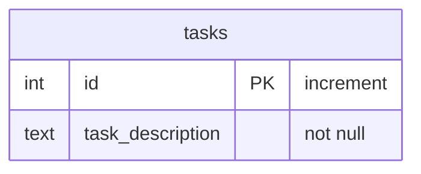

# Task Management Database Schema

This document outlines the database schema for the `tasks` table.

## Table Diagram

The following diagram illustrates the structure of the `tasks` table, including column names, data types, and constraints.

### Table Definition Explained

*   **id**: A unique integer for each task that automatically increments. It serves as the primary key (`PK`).
*   **task\_description**: The text describing the task. This field cannot be empty (`not null`).
