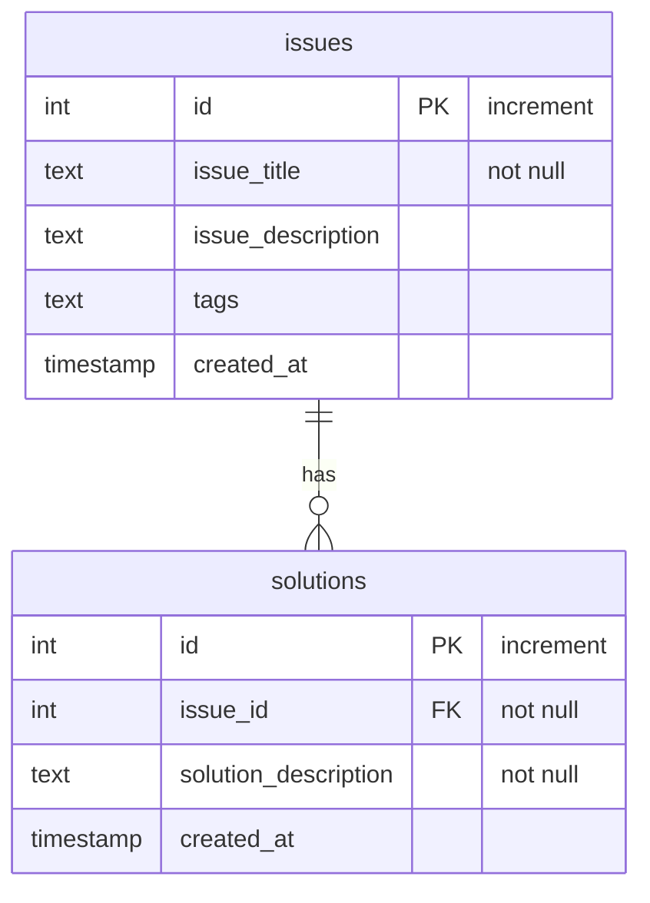

# Project Database Schema

This document outlines the database schema for the project, illustrating the relationship between `issues` and `solutions`.

## Entity-Relationship Diagram

The following diagram shows the structure of the tables and the relationship between them. An `issue` can have multiple `solutions`.

